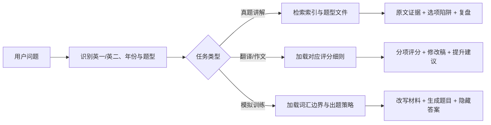

<div align="center">
  
</div>

<p align="center">
  <a href="https://github.com/nghjjnjnf/echo-kaoyan-english-skill/actions/workflows/validate.yml"></a>
  
  
  
  
  <a href="https://github.com/nghjjnjnf/echo-kaoyan-english-skill/issues"></a>
</p>

<p align="center">
  <strong>Echo_考研英语SKILL</strong> 是一个优先面向 Codex 和 Claude Code 的考研英语学习 skill。<br>
  它把真题知识库、证据链解析、全文翻译、翻译评分、作文批改和模拟训练整理成可复用的备考工作流。
</p>

<p align="center">
  <a href="#快速开始">🚀 快速开始</a> ·
  <a href="#安装方式">🧩 安装方式</a> ·
  <a href="#客户端支持">🖥️ 客户端支持</a> ·
  <a href="#真题知识库">📚 真题知识库</a> ·
  <a href="#典型用法">🧪 典型用法</a> ·
  <a href="#输出标准">✅ 输出标准</a> ·
  <a href="#修改记录">📝 修改记录</a> ·
  <a href="#贡献">🤝 贡献</a>
</p>

## 🎯 为什么做这个项目

很多考研英语讲解只停留在“答案是什么”。这个 skill 更关注“答案为什么成立”：它会把题干、选项、原文定位句、辅助句、中文翻译、错因陷阱和复盘方法放在同一个回答结构里，让使用者不需要在真题、答案和解析之间来回切换。

它不是简单的资料合集，而是一套面向 AI Agent 的考研英语备考规则层：同一份知识库可以在多个客户端中复用，同一套输出契约可以约束阅读、完形、翻译、作文和模拟题的回答质量。

项目采用“基础知识库 + 本地扩展导入”的设计：

- 仓库包含基础真题知识库。
- 基础知识库包含题面文本、题号映射、客观题答案，以及 Echo 生成的翻译参考译文、翻译/完形整体难点评析和易错点总结。
- 用户仍可通过导入脚本在本地扩展自己的资料。
- 阅读、完形、翻译、作文和模拟题分别使用独立规则，避免所有题型套同一个模板。

## ✨ 核心能力

- **真题一问即达**：覆盖英语一、英语二历年真题，可按年份、题型、篇目和题号精准定位。无论是阅读 Text、完形、翻译还是作文，都不必再手动翻找资料。

- **不只告诉你答案，更讲清证据链**：阅读解析从原文出发，标记定位句、辅助句和逻辑关系，拆解正确选项与原文的同义替换，并逐项指出干扰项错在哪里。

- **把完形讲成篇章，而不是单词选择题**：结合语法结构、固定搭配、上下文语义和篇章逻辑分析每个空，帮助你掌握真正可迁移的解题方法。

- **全文翻译也能变成精读训练**：按段落呈现自然中文译文，同时提炼重点词汇、固定搭配和长难句，让你在理解文章的同时积累可复用表达。

- **英一英二分别评分，不套通用模板**：翻译和作文严格区分考试类型、题目分值、字数要求与评分档位，给出具体扣分原因、修改建议和优化版本。

- **从出题到错题复盘，形成完整训练闭环**：生成贴近真题风格的阅读或完形练习，答题前隐藏答案，提交后再进行证据链解析，并可保存练习记录和错题，方便后续针对性复习。

## 👥 适合谁

- 正在系统刷考研英语真题，希望每道题都能追到原文证据的自学者。
- 想把阅读、完形、翻译和作文讲解流程标准化的老师、助教或学习小组。
- 希望在 Codex 或 Claude Code 中搭建个人备考知识库和错题复盘流程的用户。

## 🗺️ 功能地图

| 场景 | 你可以问什么 | skill 会怎么回答 |
| --- | --- | --- |
| 阅读理解 | `讲解 2025 年英一阅读 Text 1 第 21 题为什么选 A` | 截取必要原文，标记定位句/辅助句，逐项说明正确选项和干扰项陷阱 |
| 完形填空 | `讲解 2021 年英一完形第 8 空` | 展示完整含空句，不使用省略号，横向列出 A-D 选项并分析搭配、语义和篇章逻辑 |
| 全文翻译 | `把 2024 年英一阅读 Text 2 全文翻译，并讲重点词汇和固定搭配` | 按段落展示原文和中文译文，整理重点词汇、固定搭配、长难句和学习复盘 |
| 翻译评分 | `这是我的 2025 年英一第 46 句翻译，请按规则评分` | 区分英一 10 分制和英二 15 分制，按意群扣分，并给出基于用户版本的修改稿 |
| 作文批改 | `按 2024 年英二大作文标准批改这篇作文` | 分档评分、逐句修改、给出改后版本、结构建议和可复用表达 |
| 范文生成 | `给我一篇扎实版和高级版范文` | 根据英一/英二、小作文/大作文分值和题型要求生成两档范文 |
| 模拟训练 | `生成一篇考研英语一难度外刊阅读题` | 控制文章难度，生成题目，隐藏答案，等用户作答后再批改 |
| 真题检索 | `查 2023 年英一阅读 Text 3 的答案和题号映射` | 从 `corpus-index.json`、`question-map.json` 和题型文件定位材料 |

## 🚀 快速开始

最简单的方法：把这个 GitHub 仓库地址直接拖给 Codex 或 Claude Code，让 Agent 读取项目并按安装说明启用 skill。

Codex 推荐用 Skill Installer：

在 Codex 中输入：

```text
$skill-installer install https://github.com/nghjjnjnf/echo-kaoyan-english-skill/tree/main/skills/kaoyan-english
```

安装完成后重启 Codex，使新 skill 被发现。

完整安装、校验和排错步骤见 [安装指南](./docs/INSTALLATION.md)。

## 🧩 安装方式

### Codex

推荐路径：

```text
$skill-installer install https://github.com/nghjjnjnf/echo-kaoyan-english-skill/tree/main/skills/kaoyan-english
```

本地开发路径：

```powershell
git clone https://github.com/nghjjnjnf/echo-kaoyan-english-skill.git
cd echo-kaoyan-english-skill
python .\scripts\install_codex_skill.py
```

Codex 入口文件是 `.codex-plugin/plugin.json`、`skills/kaoyan-english/SKILL.md` 和 `skills/kaoyan-english/agents/openai.yaml`；本地开发安装脚本是 `scripts/install_codex_skill.py`。

### Claude Code

项目级使用：

```bash
git clone https://github.com/nghjjnjnf/echo-kaoyan-english-skill.git
cd echo-kaoyan-english-skill
claude
```

插件级安装：

```text
/plugin marketplace add nghjjnjnf/echo-kaoyan-english-skill
/plugin install echo-kaoyan-english-skill@echo-kaoyan-english
/reload-plugins
```

Claude Code 入口文件是 `CLAUDE.md`、`.claude/skills/kaoyan-english/SKILL.md`、`.claude-plugin/plugin.json` 和 `.claude-plugin/marketplace.json`。

## 🖥️ 客户端支持

本项目当前优先支持 Codex 和 Claude Code。核心规则只维护一份：`skills/kaoyan-english/SKILL.md`。

| 工具 | 入口文件 | 使用方式 |
| --- | --- | --- |
| Codex | `.codex-plugin/plugin.json`、`skills/kaoyan-english/SKILL.md` | 通过 Skill Installer 安装，或手动复制到 `~/.codex/skills/kaoyan-english` |
| Claude Code | `CLAUDE.md`、`.claude/skills/kaoyan-english/SKILL.md`、`.claude-plugin/plugin.json`、`.claude-plugin/marketplace.json` | 可作为项目级 skill 使用，也可通过 Claude Code marketplace/plugin 命令安装 |

完整安装、校验和排错步骤见 [安装指南](./docs/INSTALLATION.md)。

## 📚 真题知识库

仓库随附基础真题知识库，位于 `skills/kaoyan-english/references/papers/`。

当前公开知识库范围：

- 英语一：2010-2026 年。
- 英语二：2010-2026 年。
- 包含：题面文本、题号映射、客观题答案、Echo 生成的翻译参考译文、翻译/完形整体难点评析与易错点总结。
如果你要补充自己的资料，可以使用 DOCX 文件进行本地导入。导入结果可作为本地扩展使用。

导入英语一：

```powershell
python ".\skills\kaoyan-english\scripts\import_docx_papers.py" `
  "D:\papers\english_i_part1.docx" `
  --exam english-i
```

导入英语二：

```powershell
python ".\skills\kaoyan-english\scripts\import_docx_papers.py" `
  "D:\papers\english_ii_part1.docx" `
  --exam english-ii
```

知识库结构如下：

```text
references/
|-- corpus-index.json
`-- papers/
    |-- english-i/
    |   `-- 2025/
    |       |-- meta.json
    |       |-- question-map.json
    |       |-- answers.json
    |       |-- reading-text-1.md
    |       |-- cloze.md
    |       |-- translation.md
    |       `-- writing.md
    `-- english-ii/
```

完整的数据格式、导入检查和常见问题见 [真题数据指南](./docs/DATA_GUIDE.md)。

## 🧪 典型用法

下面的示例尽量接近真实学习场景。你只需要像平时提问一样说明年份、英一/英二、题型和需求，具体输出格式由 skill 自动处理。

阅读理解：

```text
2023 年英一阅读 Text 3 五道题为什么这样选？
```

完形填空：

```text
2021 年英一完形第 8 空为什么选这个？
```

翻译评分：

```text
这是我对 2025 年英一第 46 句的翻译：……
帮我评分并修改一下。
```

全文翻译：
```text
帮我翻译 2024 年英一阅读 Text 2，并讲一下里面的重点表达。
```

作文批改：

```text
这是我写的 2024 年英二大作文，帮我看看能得多少分，应该怎么改。
```

外刊模拟：

```text
帮我出一篇人工智能与就业主题的英一模拟阅读题，我做完后再给我答案和解析。
```

更多输入示例与输出结构见 [使用示例](./docs/EXAMPLES.md)。

## ✅ 输出标准

阅读题默认按以下顺序组织：

1. 题目陷阱分类
2. 相关原文截取与证据标记
3. 中文参考翻译
4. 完整题干、选项及中文翻译
5. 题干意图
6. 其他选项错因与陷阱类型
7. 正确选项证据链
8. 本题复盘

完形、翻译和作文使用独立规则：

- 完形重点分析空格位置、语法结构、固定搭配、语义匹配和篇章衔接。
- 全文翻译会区分阅读和完形，按段落展示译文，并补充重点词汇、固定搭配和长难句。
- 翻译会先识别英一或英二，再按对应总分和题型形式评分。
- 作文会区分英一/英二、小作文/大作文，并提供评分、修改、范文和知识点提炼。
- 多题解析一次最多完整处理 5 道题，优先保证每一道题的讲解深度。

## ⚙️ 工作原理



skill 采用渐进式加载：`SKILL.md` 只负责路由和核心约束，阅读、完形、翻译、作文和模拟题规则分别放在 `references/` 中；真题材料按年份和题型拆分，避免一次性加载全部文本。

## 📁 项目结构

```text
echo-kaoyan-english-skill/
|-- AGENTS.md
|-- CLAUDE.md
|-- .codex-plugin/plugin.json
|-- .claude-plugin/
|   |-- plugin.json
|   `-- marketplace.json
|-- .claude/skills/kaoyan-english/SKILL.md
|-- skills/kaoyan-english/
|   |-- SKILL.md
|   |-- agents/openai.yaml
|   |-- scripts/
|   |   |-- import_docx_papers.py
|   |   |-- search_papers.py
|   |   |-- fetch_source_article.py
|   |   |-- save_exercise.py
|   |   |-- validate_generated_exercise.py
|   |   |-- record_practice.py
|   |   `-- review_mistakes.py
|   `-- references/
|       |-- corpus-index.json
|       |-- rubrics/
|       |-- strategies/
|       |-- vocabulary/
|       `-- papers/
|-- docs/
|-- tests/
|-- scripts/install_codex_skill.py
`-- .github/
```

## 🧰 本地校验

```powershell
python -m pip install -r requirements-dev.txt
python scripts/validate_repo.py
python -m unittest discover -s tests -v
```

校验覆盖：

- 插件清单、skill frontmatter、必需脚本和 Codex/Claude Code 入口文件。
- 数据结构边界，避免把本地源文件、作文范文或临时资料混入仓库。
- 模拟题词数、答案隐藏、难度配比、练习记录和响应契约。
- 阅读/完形/作文/全文翻译等核心输出结构的回归检查。

## 🗓️ 路线图

- [x] 阅读与完形分题型深度解析
- [x] 英一/英二翻译差异化评分
- [x] 英一/英二大小作文分档批改
- [x] DOCX 真题清理、拆分与索引
- [x] 用户词汇表覆盖率报告
- [x] 模拟题结构化保存、词数校验与答案隐藏检查
- [x] 阅读/完形/作文输出契约回归检查
- [x] 阅读和完形全文翻译、重点词汇、固定搭配与长难句讲解
- [ ] 更稳健的多来源文档解析
- [ ] 可复现的提示词评测集
- [ ] 更多新题型专项规则

## 📝 修改记录

所有对外可见的功能、文档、安装方式和客户端支持范围变更都会记录在 [CHANGELOG.md](./CHANGELOG.md)。后续提交前应同步更新该文件。

## 🤝 贡献

欢迎提交解析规则、导入器兼容性、测试用例和文档改进。提交前请阅读 [贡献指南](./CONTRIBUTING.md)，并确保本地校验通过。

适合贡献的内容包括：

- 新来源 DOCX 的导入兼容性修复
- 阅读、完形、翻译、作文评分规则补充
- 更好的示例 prompt 和输出样例
- 测试用例、文档纠错和安装体验优化
