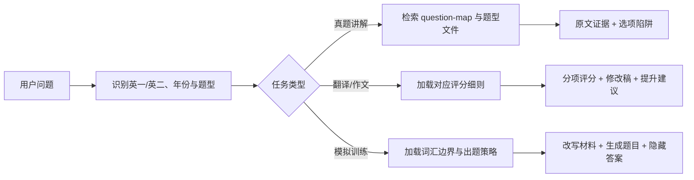

<div align="center">
  
</div>

<p align="center">
  <a href="https://github.com/nghjjnjnf/echo-kaoyan-english-skill/actions/workflows/validate.yml"></a>
  
  
  <a href="./LICENSE"></a>
  
</p>

<p align="center">
  为考研英语一与英语二设计的 Codex 学习助手。<br>
  把真题检索、证据链讲解、翻译评分、作文批改和模拟训练组织成稳定、可复用的工作流。
</p>

## 它能做什么

| 能力 | 结果特点 |
| --- | --- |
| 阅读理解精析 | 展示必要原文、标记定位句与辅助句、逐项解释陷阱，并给出同义替换链 |
| 完形填空精析 | 围绕语法、搭配、语义与篇章逻辑分析，四个选项横向展示 |
| 翻译评分与讲解 | 自动区分英一 10 分制与英二 15 分制，按意群给分并提供修改稿 |
| 作文评分与批改 | 区分英一/英二及大小作文，分档评分、逐句修改，并提供扎实版与高级版范文 |
| 外刊模拟训练 | 生成阅读或完形练习，并根据考研词表控制超纲词汇 |
| 本地真题知识库 | 将合法取得的 DOCX 真题拆分为年份、题型、题号和答案索引 |

这个项目关注的不是“只报答案”，而是让每一道题都能回到原文证据、题干约束和干扰项机制。

## 快速开始

### 方式一：使用 Skill Installer

在 Codex 中输入：

```text
$skill-installer install https://github.com/nghjjnjnf/echo-kaoyan-english-skill/tree/main/skills/kaoyan-english
```

安装完成后重启 Codex，使新 skill 被发现。

### 方式二：手动安装

```powershell
git clone https://github.com/nghjjnjnf/echo-kaoyan-english-skill.git
New-Item -ItemType Directory -Force "$env:USERPROFILE\.codex\skills" | Out-Null
Copy-Item -Recurse ".\kaoyan-english\skills\kaoyan-english" "$env:USERPROFILE\.codex\skills\kaoyan-english"
python -m pip install -r ".\kaoyan-english\requirements.txt"
```

macOS 或 Linux：

```bash
git clone https://github.com/nghjjnjnf/echo-kaoyan-english-skill.git
mkdir -p ~/.codex/skills
cp -R kaoyan-english/skills/kaoyan-english ~/.codex/skills/kaoyan-english
python3 -m pip install -r kaoyan-english/requirements.txt
```

## 准备真题知识库

仓库不分发真题原文。请使用自己合法取得的 DOCX 文件进行本地导入：

```powershell
python ".\skills\kaoyan-english\scripts\import_docx_papers.py" `
  "D:\papers\english_i_part1.docx" `
  --exam english-i
```

英语二使用：

```powershell
python ".\skills\kaoyan-english\scripts\import_docx_papers.py" `
  "D:\papers\english_ii_part1.docx" `
  --exam english-ii
```

脚本会清理已知页眉和公众号信息，并生成：

```text
references/
├── corpus-index.json
└── papers/
    ├── english-i/
    │   └── 2025/
    │       ├── meta.json
    │       ├── question-map.json
    │       ├── answers.json
    │       ├── reading-text-1.md
    │       ├── cloze.md
    │       ├── translation.md
    │       └── writing.md
    └── english-ii/
```

完整的数据格式、导入检查和常见问题见 [真题数据指南](./docs/DATA_GUIDE.md)。

## 直接这样问

```text
讲解 2025 年英一阅读第一篇第 21 题，说明为什么选 A。
```

```text
讲解 2021 年英一完形第 8 空，其他选项为什么不合适？
```

```text
这是我的 2023 年英一第 47 句翻译，请按 2 分制评分并在我的版本上修改：……
```

```text
请按 2024 年英二大作文标准给这篇作文评分，逐句批改，并给出扎实版范文。
```

```text
找一篇适合考研英语一的外刊主题，生成 5 道阅读题，超纲词替换为考研词汇。
```

更多输入示例与输出结构见 [使用示例](./docs/EXAMPLES.md)。

## 回答质量约束

阅读题默认按以下顺序组织：

1. 题目陷阱分类
2. 相关原文截取与证据标记
3. 中文参考翻译
4. 完整题干、选项及中文翻译
5. 题干意图
6. 其他选项错因与陷阱类型
7. 正确选项证据链
8. 本题复盘

完形、翻译和作文分别使用独立评分与讲解规则，不套用同一份通用模板。一次可完整解析最多 5 道阅读题或 5 个完形空，优先保证每一题的分析深度。

## 工作原理



skill 采用渐进式加载：主文件只负责路由，阅读、完形、翻译、作文和模拟题规则分别存放在 `references/`，真题则按年份和题型读取，避免一次性塞入全部文本。

## 项目结构

```text
kaoyan-english/
├── .codex-plugin/plugin.json
├── skills/kaoyan-english/
│   ├── SKILL.md
│   ├── agents/openai.yaml
│   ├── scripts/
│   │   ├── import_docx_papers.py
│   │   └── search_papers.py
│   └── references/
│       ├── rubrics/
│       ├── strategies/
│       ├── vocabulary/
│       └── papers/
├── docs/
├── tests/
└── .github/
```

## 本地校验

```powershell
python -m pip install -r requirements-dev.txt
python scripts/validate_repo.py
python -m unittest discover -s tests -v
```

## 路线图

- [x] 阅读与完形分题型深度解析
- [x] 英一/英二翻译差异化评分
- [x] 英一/英二大小作文分档批改
- [x] DOCX 真题清理、拆分与索引
- [ ] 用户词汇表导入与覆盖率报告
- [ ] 更稳健的多来源文档解析
- [ ] 可复现的提示词评测集
- [ ] 更多新题型专项规则

## 参与贡献

欢迎提交解析规则、导入器兼容性、测试用例和文档改进。提交前请阅读 [贡献指南](./CONTRIBUTING.md)。

请不要在 Issue 或 Pull Request 中上传未经授权的真题全文、培训机构讲义或其他第三方受版权保护材料。

## 版权与声明

代码、提示词工作流和项目文档以 [MIT License](./LICENSE) 发布。考研真题、参考答案、外刊文章及第三方资料不包含在本许可范围内，也不随仓库分发。详见 [NOTICE](./NOTICE.md)。

本项目是独立的学习工具，与教育主管部门、考试命题机构或任何培训机构不存在隶属、授权或背书关系。
