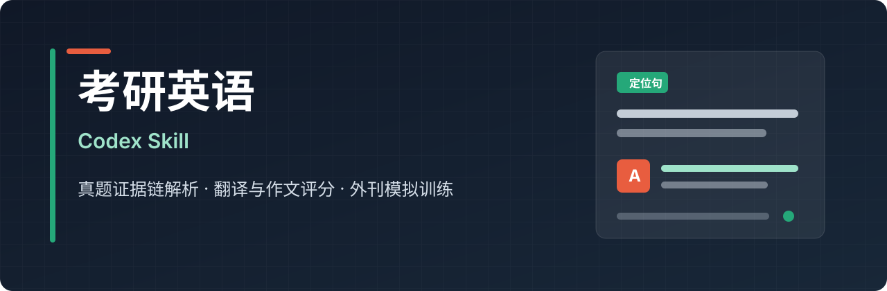
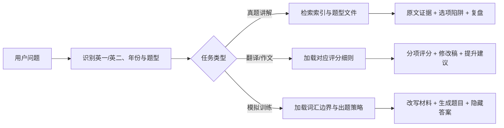

<div align="center">
  
</div>

<p align="center">
  <a href="https://github.com/nghjjnjnf/echo-kaoyan-english-skill/actions/workflows/validate.yml"></a>
  
  
  <a href="./LICENSE"></a>
  
  
  <a href="https://github.com/nghjjnjnf/echo-kaoyan-english-skill/issues"></a>
</p>

<p align="center">
  <strong>Echo_考研英语SKILL</strong> 是一个面向 Codex、Claude Code、Cursor 和 Trae 的考研英语学习 skill。<br>
  它把真题知识库、证据链解析、全文翻译、翻译评分、作文批改和模拟训练整理成可复用的备考工作流。
</p>

<p align="center">
  <a href="#快速开始">快速开始</a> ·
  <a href="#多-agent-使用">多 Agent 使用</a> ·
  <a href="#真题知识库">真题知识库</a> ·
  <a href="#典型用法">典型用法</a> ·
  <a href="#输出标准">输出标准</a> ·
  <a href="#贡献">贡献</a>
</p>

## 为什么做这个项目

很多考研英语讲解只停留在“答案是什么”。这个 skill 更关注“答案为什么成立”：它会把题干、选项、原文定位句、辅助句、中文翻译、错因陷阱和复盘方法放在同一个回答结构里，让使用者不需要在真题、答案和解析之间来回切换。

它不是简单的资料合集，而是一套面向 AI Agent 的考研英语备考规则层：同一份知识库可以在多个客户端中复用，同一套输出契约可以约束阅读、完形、翻译、作文和模拟题的回答质量。

项目采用“公开基础知识库 + 本地扩展导入”的设计：

- 公开仓库包含维护者声明有权发布的基础真题知识库。
- 基础知识库包含题面文本、题号映射、客观题答案，以及 Echo 生成的翻译参考译文、翻译/完形整体难点评析和易错点总结。
- 基础知识库不包含逐题官方解析、作文范文、原始 Word 或第三方课程材料。
- 用户仍可通过导入脚本在本地扩展自己的资料。
- 阅读、完形、翻译、作文和模拟题分别使用独立规则，避免所有题型套同一个模板。

## 核心亮点

- **真题可检索**：按英语一/英语二、年份、题型和题号组织材料，支持快速定位阅读 Text、完形、翻译和作文题。
- **解析有证据链**：阅读题会先给陷阱分类，再截取必要原文，标记定位句和辅助句，逐项拆解正确选项与干扰项。
- **完形更像真题训练**：按空格功能、固定搭配、语义递进、逻辑衔接和词义辨析拆解，不把完形讲成孤立词汇题。
- **全文翻译可学习**：支持阅读和完形全文翻译，按段落给中文译文，并整理重点词汇、固定搭配和长难句。
- **评分区分英一英二**：翻译和作文按题型实际分值、字数建议和评分档位处理，避免混用标准。
- **模拟题可闭环**：先生成题目并隐藏答案，用户作答后再按真题风格讲解；需要时可把练习、答案和解析保存到本地记录。
- **多客户端可用**：仓库内置 Codex、Claude Code、Cursor 和 Trae 入口，让同一套规则可以在不同 Agent 环境中调用。

## 适合谁

- 正在系统刷考研英语真题，希望每道题都能追到原文证据的自学者。
- 想把阅读、完形、翻译和作文讲解流程标准化的老师、助教或学习小组。
- 希望在 Codex、Claude Code、Cursor 或 Trae 中搭建个人备考知识库和错题复盘流程的用户。

## 功能地图

| 场景 | 你可以问什么 | skill 会怎么回答 |
| --- | --- | --- |
| 阅读理解 | `讲解 2025 年英一阅读 Text 1 第 21 题为什么选 A` | 截取必要原文，标记定位句/辅助句，逐项说明正确选项和干扰项陷阱 |
| 完形填空 | `讲解 2021 年英一完形第 8 空` | 展示完整含空句，不使用省略号，横向列出 A-D 选项并分析搭配、语义和篇章逻辑 |
| 全文翻译 | `把 2024 年英一阅读 Text 2 全文翻译，并讲重点词汇和固定搭配` | 按段落展示原文和中文译文，整理重点词汇、固定搭配、长难句和学习复盘 |
| 翻译评分 | `这是我的 2025 年英一第 46 句翻译，请按 2 分制评分` | 区分英一 10 分制和英二 15 分制，按意群扣分，并给出基于用户版本的修改稿 |
| 作文批改 | `按 2024 年英二大作文标准批改这篇作文` | 分档评分、逐句修改、给出改后版本、结构建议和可复用表达 |
| 范文生成 | `给我一篇扎实版和高级版范文` | 根据英一/英二、小作文/大作文分值和题型要求生成两档范文 |
| 模拟训练 | `生成一篇考研英语一难度外刊阅读题` | 控制文章难度，生成题目，隐藏答案，等用户作答后再批改 |
| 真题检索 | `查 2023 年英一阅读 Text 3 的答案和题号映射` | 从 `corpus-index.json`、`question-map.json` 和题型文件定位材料 |

## 快速开始

### 使用 Skill Installer

在 Codex 中输入：

```text
$skill-installer install https://github.com/nghjjnjnf/echo-kaoyan-english-skill/tree/main/skills/kaoyan-english
```

安装完成后重启 Codex，使新 skill 被发现。

### 手动安装

Windows PowerShell：

```powershell
git clone https://github.com/nghjjnjnf/echo-kaoyan-english-skill.git
New-Item -ItemType Directory -Force "$env:USERPROFILE\.codex\skills" | Out-Null
Copy-Item -Recurse ".\echo-kaoyan-english-skill\skills\kaoyan-english" "$env:USERPROFILE\.codex\skills\kaoyan-english"
python -m pip install -r ".\echo-kaoyan-english-skill\requirements.txt"
```

macOS 或 Linux：

```bash
git clone https://github.com/nghjjnjnf/echo-kaoyan-english-skill.git
mkdir -p ~/.codex/skills
cp -R echo-kaoyan-english-skill/skills/kaoyan-english ~/.codex/skills/kaoyan-english
python3 -m pip install -r echo-kaoyan-english-skill/requirements.txt
```

## 多 Agent 使用

本项目已经补充 Codex、Claude Code、Cursor 和 Trae 的项目入口。核心规则仍然只维护一份：`skills/kaoyan-english/SKILL.md`。

| 工具 | 入口文件 | 使用方式 |
| --- | --- | --- |
| Codex | `.codex-plugin/plugin.json`、`skills/kaoyan-english/SKILL.md` | 通过 Skill Installer 安装，或手动复制到 `~/.codex/skills/kaoyan-english` |
| Claude Code | `CLAUDE.md`、`.claude/skills/kaoyan-english/SKILL.md` | 克隆仓库后在 Claude Code 中打开项目，按项目记忆与 skill wrapper 读取核心规则 |
| Cursor | `AGENTS.md`、`.cursor/rules/kaoyan-english.mdc`、`.cursor/rules/kaoyan-english/RULE.md` | 在 Cursor 中打开仓库，Agent 会从项目规则进入核心 skill |
| Trae | `.trae/project_rules.md`、`.trae/rules/kaoyan-english.md` | 在 Trae 中打开仓库，先读取项目规则，再读取核心 skill |

详细说明见 [多 Agent 使用指南](./docs/AGENT_COMPATIBILITY.md)。

## 真题知识库

仓库随附维护者声明有权发布的基础真题知识库，位于 `skills/kaoyan-english/references/papers/`。

当前公开知识库范围：

- 英语一：2010-2026 年。
- 英语二：2010-2026 年。
- 包含：题面文本、题号映射、客观题答案、Echo 生成的翻译参考译文、翻译/完形整体难点评析与易错点总结。
- 不包含：逐题官方解析、作文范文、原始 Word 文件。

如果你要补充自己的资料，请使用自己合法取得的 DOCX 文件进行本地导入。导入结果可作为本地扩展使用，提交到公开仓库前应确认再分发权限。

导入英语一：

```powershell
python ".\skills\kaoyan-english\scripts\import_docx_papers.py" `
  "D:\papers\english_i_part1.docx" `
  --exam english-i
```

导入英语二：

```powershell
python ".\skills\kaoyan-english\scripts\import_docx_papers.py" `
  "D:\papers\english_ii_part1.docx" `
  --exam english-ii
```

知识库结构如下：

```text
references/
|-- corpus-index.json
`-- papers/
    |-- english-i/
    |   `-- 2025/
    |       |-- meta.json
    |       |-- question-map.json
    |       |-- answers.json
    |       |-- reading-text-1.md
    |       |-- cloze.md
    |       |-- translation.md
    |       `-- writing.md
    `-- english-ii/
```

完整的数据格式、导入检查和常见问题见 [真题数据指南](./docs/DATA_GUIDE.md)。

## 典型用法

阅读理解：

```text
讲解 2023 年英一阅读 Text 3 的五道题，保持每一题与单题解析相同的深度。
```

完形填空：

```text
讲解 2021 年英一完形第 8 空。原句不要使用省略号，四个选项横向排列。
```

翻译评分：

```text
这是我对 2025 年英一第 46 句的翻译：……
请按 2 分制逐意群评分，说明每处扣分，并在我的版本上修改。
```

全文翻译：
```text
把 2024 年英一阅读 Text 2 全文翻译成中文，并整理重点词汇、固定搭配和长难句。
```

作文批改：

```text
请按 2024 年英二大作文 15 分制批改下面的作文，给出逐句修改和可复用结构。
```

外刊模拟：

```text
围绕人工智能与就业生成一篇考研英语一难度的模拟阅读，出 5 道四选一题。先隐藏答案，等我提交后再批改。
```

更多输入示例与输出结构见 [使用示例](./docs/EXAMPLES.md)。

## 输出标准

阅读题默认按以下顺序组织：

1. 题目陷阱分类
2. 相关原文截取与证据标记
3. 中文参考翻译
4. 完整题干、选项及中文翻译
5. 题干意图
6. 其他选项错因与陷阱类型
7. 正确选项证据链
8. 本题复盘

完形、翻译和作文使用独立规则：

- 完形重点分析空格位置、语法结构、固定搭配、语义匹配和篇章衔接。
- 全文翻译会区分阅读和完形，按段落展示译文，并补充重点词汇、固定搭配和长难句。
- 翻译会先识别英一或英二，再按对应总分和题型形式评分。
- 作文会区分英一/英二、小作文/大作文，并提供评分、修改、范文和知识点提炼。
- 多题解析一次最多完整处理 5 道题，优先保证每一道题的讲解深度。

## 工作原理



skill 采用渐进式加载：`SKILL.md` 只负责路由和核心约束，阅读、完形、翻译、作文和模拟题规则分别放在 `references/` 中；真题材料按年份和题型拆分，避免一次性加载全部文本。

## 项目结构

```text
echo-kaoyan-english-skill/
|-- AGENTS.md
|-- CLAUDE.md
|-- .codex-plugin/plugin.json
|-- .claude/skills/kaoyan-english/SKILL.md
|-- .cursor/rules/kaoyan-english.mdc
|-- .cursor/rules/kaoyan-english/RULE.md
|-- .trae/project_rules.md
|-- skills/kaoyan-english/
|   |-- SKILL.md
|   |-- agents/openai.yaml
|   |-- scripts/
|   |   |-- import_docx_papers.py
|   |   |-- search_papers.py
|   |   |-- fetch_source_article.py
|   |   |-- save_exercise.py
|   |   |-- validate_generated_exercise.py
|   |   |-- record_practice.py
|   |   `-- review_mistakes.py
|   `-- references/
|       |-- corpus-index.json
|       |-- rubrics/
|       |-- strategies/
|       |-- vocabulary/
|       `-- papers/
|-- docs/
|-- tests/
`-- .github/
```

## 本地校验

```powershell
python -m pip install -r requirements-dev.txt
python scripts/validate_repo.py
python -m unittest discover -s tests -v
```

校验覆盖：

- 插件清单、skill frontmatter、必需脚本和多 Agent 入口文件。
- 公开数据边界，避免把原始 Word、作文范文或不应公开的资料混入仓库。
- 模拟题词数、答案隐藏、难度配比、练习记录和响应契约。
- 阅读/完形/作文/全文翻译等核心输出结构的回归检查。

## 路线图

- [x] 阅读与完形分题型深度解析
- [x] 英一/英二翻译差异化评分
- [x] 英一/英二大小作文分档批改
- [x] DOCX 真题清理、拆分与索引
- [x] 用户词汇表覆盖率报告
- [x] 模拟题结构化保存、词数校验与答案隐藏检查
- [x] 阅读/完形/作文输出契约回归检查
- [x] 阅读和完形全文翻译、重点词汇、固定搭配与长难句讲解
- [ ] 更稳健的多来源文档解析
- [ ] 可复现的提示词评测集
- [ ] 更多新题型专项规则

## 贡献

欢迎提交解析规则、导入器兼容性、测试用例和文档改进。提交前请阅读 [贡献指南](./CONTRIBUTING.md)，并确保本地校验通过。

适合贡献的内容包括：

- 新来源 DOCX 的导入兼容性修复
- 阅读、完形、翻译、作文评分规则补充
- 更好的示例 prompt 和输出样例
- 测试用例、文档纠错和安装体验优化
